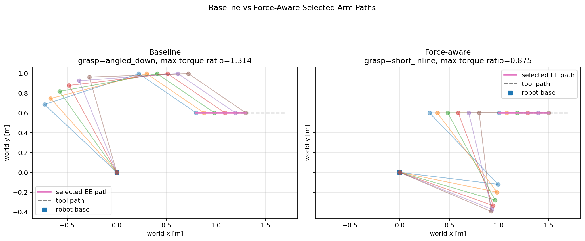
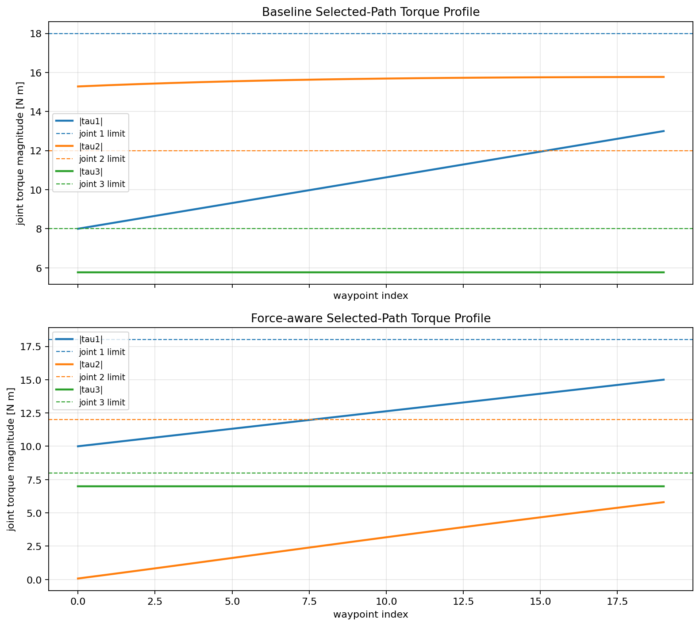

# Force-Aware Tool-Use Planning

A deterministic robotics planning demo showing why geometric reachability alone
is insufficient for tool-use tasks.

A robot configuration may follow a desired tool path while requiring joint
torques beyond the robot's limits. This project compares a geometric baseline
planner with a force-aware planner that evaluates the desired planar wrench:

```text
tau = J(q).T @ F
```

The baseline checks inverse kinematics and joint limits. The force-aware planner
also rejects configurations that violate joint torque limits, then selects a
smooth feasible trajectory.

## Technical Overview

The current planner uses:

- a planar 3-link revolute arm;
- planar poses `[x, y, theta]`;
- candidate rigid grasp transforms;
- deterministic analytic inverse kinematics;
- joint-limit and torque-limit filtering;
- layered dynamic programming for smooth path selection;
- structured diagnostics for accepted and rejected candidates.

The planning pipeline is:

```text
tool path
-> grasp transforms
-> end-effector paths
-> IK candidates
-> joint-limit filtering
-> torque checks
-> smooth path selection
```

## Results

For the default deterministic scenario, the baseline selects a geometrically
valid path with a maximum torque ratio of `1.314`, exceeding a joint limit. The
force-aware planner selects a different grasp and remains feasible with a
maximum torque ratio of `0.875`.

<p align="center">
  
</p>

<p align="center">
  
</p>

## Capabilities

- Compare geometric-only and force-aware planning.
- Generate multiple IK branches for each grasp and waypoint.
- Preserve torque and joint-limit rejection diagnostics.
- Configure the arm, task wrench, tool path, and grasps through YAML.
- Generate deterministic path, torque, and filtering figures.
- Run the planner independently of ROS2.
- Build the ROS2 package used for execution and RViz integration.

## Quick Start

Requirements: Python 3, NumPy, Matplotlib, PyYAML, and pytest.

```bash
python3 -m venv .venv
source .venv/bin/activate
python3 -m pip install -r requirements.txt

python3 -m pytest -q
python3 scripts/run_baseline_vs_force_aware.py
```

The main demo prints the selected grasps and torque-feasibility results, then
saves figures under `media/figures/`.

Run only the force-aware planner:

```bash
python3 scripts/run_phase1_planner.py
```

Use a custom scenario:

```bash
python3 scripts/run_baseline_vs_force_aware.py --config path/to/config.yaml
```

The default scenario is defined in
[`configs/demo_planar_arm.yaml`](configs/demo_planar_arm.yaml).

## ROS2 Package

Phase 2 uses ROS2 Humble in a separate workspace so the planning package remains
independent of ROS2:

```bash
source /opt/ros/humble/setup.bash
cd ros2_ws
colcon build --packages-select force_tool_planning_ros
source install/setup.bash
ros2 launch force_tool_planning_ros display.launch.py
```

Implementation status and the ROS2 integration roadmap are maintained in the
project status document linked below.

## Limitations

The wrench is a simplified planar task wrench, and grasps are rigid planar
transforms. The project does not currently model contact physics, grasp
stability, gravity, full dynamics, real force control, or real robot execution.
The ROS2 integration uses mock position execution and does not physically
validate the planned wrench.

## Documentation

- [Project status, repository structure, and roadmap](docs/PROJECT_STATUS.md)
- [Phase 1 implementation instructions](.agents/skills/force-aware-tool-use/PHASE1_INSTRUCTIONS.md)
- [Phase 2 implementation plan and status](.agents/skills/force-aware-tool-use/PHASE2_INSTRUCTIONS.md)
