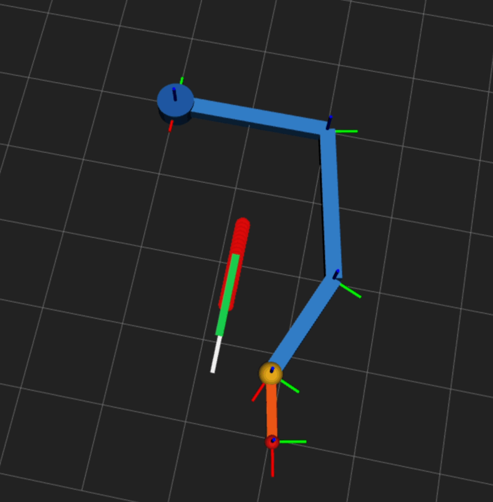
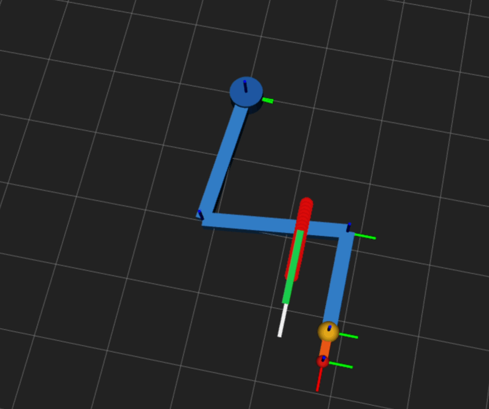

# Force-Aware Tool-Use Planning and Execution

Geometry-only planning can find a reachable path, but the required task wrench may exceed joint torque limits.
This repo demonstrates a minimal force-aware planner and execution-oriented
visualization pipeline for tool-use motions that are geometrically valid but
physically constrained.

A robot configuration may follow a desired tool path while requiring joint
torques beyond the robot's limits. This project compares a geometric baseline
planner with a force-aware planner that evaluates the desired planar wrench:

```text
tau = J(q).T @ F
```

The baseline checks inverse kinematics and joint limits. The force-aware planner
also rejects configurations that violate joint torque limits, then selects a
smooth feasible trajectory.

## Technical Overview

The current planner uses:

- a planar 3-link revolute arm;
- planar poses `[x, y, theta]`;
- candidate rigid grasp transforms;
- deterministic analytic inverse kinematics;
- joint-limit and torque-limit filtering;
- layered dynamic programming for smooth path selection;
- structured diagnostics for accepted and rejected candidates.

The planning pipeline is:

```text
tool path
-> grasp transforms
-> end-effector paths
-> IK candidates
-> joint-limit filtering
-> torque checks
-> smooth path selection
```

## Results

For the default deterministic scenario, the baseline selects a geometrically
valid path with a maximum torque ratio of `1.314`, exceeding a joint limit. The
force-aware planner selects a different grasp and remains feasible with a
maximum torque ratio of `0.875`.

<table>
  <tr>
    <th>Geometric Baseline: Torque-Infeasible</th>
    <th>Force-Aware: Torque-Feasible</th>
  </tr>
  <tr>
    <td></td>
    <td></td>
  </tr>
</table>

<p align="center">
  
</p>

<p align="center">
  
</p>

## Capabilities

- Compare geometric-only and force-aware planning.
- Generate multiple IK branches for each grasp and waypoint.
- Preserve torque and joint-limit rejection diagnostics.
- Configure the arm, task wrench, tool path, and grasps through YAML.
- Generate deterministic path, torque, and filtering figures.
- Run the planner independently of ROS2.
- Build the ROS2 package used for execution and RViz integration.
- Plan the next contact-constrained execution phase without changing the
  completed Phase 1 planner or Phase 2 mock-control demo.

## Quick Start

Requirements: Python 3, NumPy, Matplotlib, PyYAML, and pytest.

```bash
python3 -m venv .venv
source .venv/bin/activate
python3 -m pip install -r requirements.txt

python3 -m pytest -q
python3 scripts/run_baseline_vs_force_aware.py
```

The main demo prints the selected grasps and torque-feasibility results, then
saves figures under `media/figures/`.

Run only the force-aware planner:

```bash
python3 scripts/run_phase1_planner.py
```

Use a custom scenario:

```bash
python3 scripts/run_baseline_vs_force_aware.py --config path/to/config.yaml
```

The default scenario is defined in
[`configs/demo_planar_arm.yaml`](configs/demo_planar_arm.yaml).

## ROS2 Package

Phase 2 is complete and uses ROS2 Humble in a separate workspace so the
planning package remains independent of ROS2:

```bash
source /opt/ros/humble/setup.bash
cd ros2_ws
colcon build --packages-select force_tool_planning_ros
source install/setup.bash
ros2 launch force_tool_planning_ros phase2.launch.py
```

The diagnostic launches below remain available for isolated visualization or
controller checks. To verify mock hardware and activate both ros2_control
controllers without opening RViz:

```bash
ros2 launch force_tool_planning_ros control.launch.py
ros2 control list_controllers
ros2 topic echo /joint_states --once
```

With `control.launch.py` running, send the selected force-aware path from a
second sourced terminal:

```bash
ros2 run force_tool_planning_ros trajectory_sender_node
```

The sender first positions the mock arm at the first planned waypoint, then
sends only the torque-feasible force-aware path.

Run the complete Phase 2 demo with one command:

```bash
ros2 launch force_tool_planning_ros phase2.launch.py
```

This opens RViz, publishes the planning diagnostics, activates mock hardware
and controllers, then executes the force-aware path twice.

To visualize the geometric baseline path selected without torque filtering:

```bash
ros2 launch force_tool_planning_ros baseline_demo.launch.py
```

The baseline demo also runs twice, but it is explicitly a mock-hardware visual
comparison of a path known to violate the Phase 1 torque limits.

Final verification completed with `58` Phase 1 tests and `34` ROS2 package
tests passing with no failures. Both complete demos were also verified live
through their final selected joint waypoints.

### How to Read the RViz Display

RViz shows two different kinds of visuals:

1. **`RobotModel` is the moving robot.** It is generated from the URDF and
   follows the joint states published by the mock controller.
2. **`Planning Diagnostics` is not another robot model.** It is one static
   `MarkerArray` overlay containing four planning-result visualizations:

| Visual | Meaning |
| --- | --- |
| White line | Desired tool-tip (the small red sphere in RViz) path requested by the task. |
| Orange line | End-effector (the yellow sphere in RViz) path selected by the geometric baseline planner. |
| Red spheres | Baseline waypoints where the required joint torque exceeds at least one torque limit. |
| Green line | End-effector path selected by the force-aware planner; this path satisfies the Phase 1 torque limits. |

The colored diagnostics remain stationary while the robot moves. They are
reference paths, not extra arms or trails generated by the current motion.
The white tool-tip path can also differ from the orange and green end-effector
paths because each planner selects a grasp transform between the robot end
effector and the tool tip. The markers are drawn at slightly different heights
above the XY plane so overlapping paths remain visible.

Implementation status and the ROS2 integration roadmap are maintained in the
project status document linked below.

## Phase 3 Roadmap

Phase 3 is planned as contact-constrained tool-use execution. It will add a
simplified 2D tool-surface contact model and compare position-only execution
with force-aware feedback execution.

The purpose is to show that a planned tool-use trajectory may be geometrically
reachable and torque-aware, but still perform poorly during execution if
contact forces are ignored. The core Phase 3 simulation is expected to run
without ROS2; ROS2/RViz remains a visualization and replay layer.

## Limitations

The wrench is a simplified planar task wrench, and grasps are rigid planar
transforms. The implemented phases do not model full contact physics, grasp
stability, gravity, full dynamics, real force control, or real robot execution.
The ROS2 integration uses mock position execution and does not physically
validate the planned wrench. Planned Phase 3 contact execution remains a
simplified deterministic model, not Gazebo physics, impedance control, or
hardware validation.

## Documentation

- [Project status, repository structure, and roadmap](docs/PROJECT_STATUS.md)
- [Purpose of each executable and launch file](docs/EXECUTABLES_AND_LAUNCH_FILES.md)
- [Phase 3 contact execution design notes](docs/PHASE3_CONTACT_EXECUTION.md)
- [Phase 1 implementation instructions](.agents/skills/force-aware-tool-use/PHASE1_INSTRUCTIONS.md)
- [Phase 2 implementation plan and status](.agents/skills/force-aware-tool-use/PHASE2_INSTRUCTIONS.md)
- [Phase 3 implementation plan](.agents/skills/force-aware-tool-use/PHASE3_INSTRUCTIONS.md)

## License

This project is licensed under the [MIT License](LICENSE).
